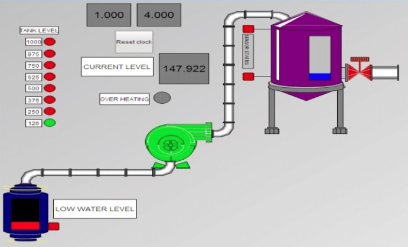

# LabVIEW-Process-Control: Industrial Tank Level PID
> **Closed-Loop Automation System for Real-Time Fluid Dynamics Management**


---

## Project Overview
This repository hosts a high-reliability **Process Control Engine** developed in **NI LabVIEW**. The system implements a complete automation cycle for tank level management, focusing on stability, noise reduction in data acquisition, and precise actuator response.

It demonstrates a modular architecture where data flow is strictly decoupled: **Acquisition ➡️ Processing (PID) ➡️ Actuation.**

---

## HMI & Visualization (System in Action!)

The front panel below is the core interface of the system, showcasing real-time telemetry, historical trends, and control parameters. **This visualization proves the successful implementation of the closed-loop strategy.**

<p align="center">
  
</p>

### Key Dashboard Features:
* **Real-time Level Tracking:** Visual chart showing the current level (`Process Variable`) converging toward the desired level (`Set-Point`).
* **PID Parameter Access:** Live tuning interface for Proportional, Integral, and Derivative gains.
* **Dynamic Actuator Status:** Instant feedback on pump and valve activation states.
* **Manual/Auto Modes:** Switch for testing actuators directly or engaging the AI-driven PID.

---

## Control Architecture

The system operates on a classic **Closed-Loop (Feedback)** control strategy:

```mermaid
graph LR
    SP[Set-Point] --> Sum((+/-))
    Sum --> PID[PID Controller]
    PID --> ACT[Actuator Object]
    ACT --> Tank[Physical Process]
    Tank --> DAQ[Data Acquisition]
    DAQ -- Feedback --o Sum
    style PID fill:#ff9,stroke:#333,stroke-width:2px


